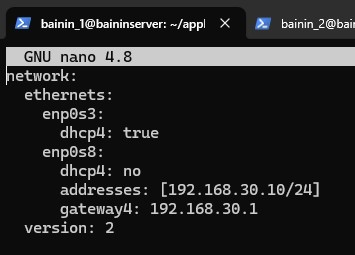
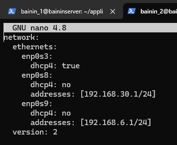
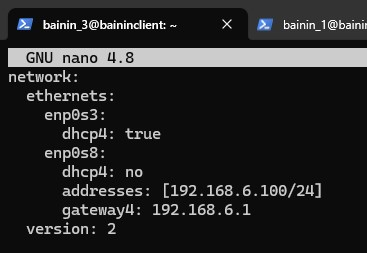
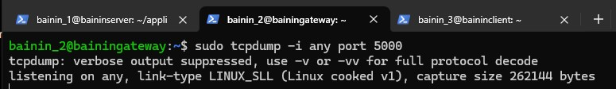
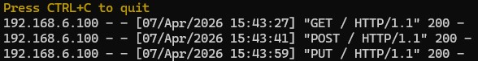
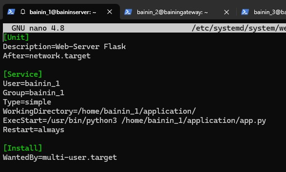
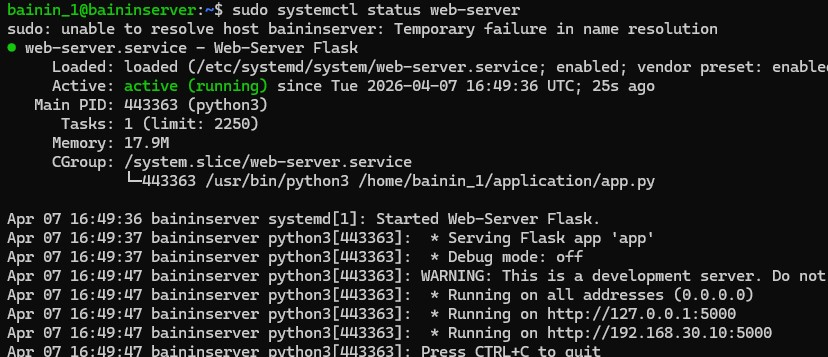

# Отчет по практической работе: Базовые принципы адм
## Введение
Данная практика посвящена базовым принципам администрирования ОС Linux. Для выполнения практики необходимо развернуть 3 виртуальные машины Linux. 
В качестве среды виртуализации используется VirtualBox, операционная система — Ubuntu Server 20.04.

---

## Цели и исходные данные
**Цель работы:** Настройка трех виртуальных машин Linux (сервер, шлюз и клиент), конфигурация сети между ними, настройка маршрутизации с фильтрацией трафика и развертывание простого веб-сервера.

**Инструменты:** VirtualBox, Ubuntu Server 20.04.06 LTS.

**Исходные данные студента:**
* Фамилия: Байнин
* День рождения: 30
* Месяц рождения: июнь

---

## Глава 1. Подготовка виртуальных машин

### 1.1. Linux_A (Сервер)
* **Имя машины:** lin1
* **Пользователь:** bainin_1

### 1.2. Linux_B (Шлюз)
* **Имя машины:** lin2
* **Пользователь:** bainin_2

### 1.3. Linux_C (Клиент)
* **Имя машины:** lin3
* **Пользователь:** bainin_3

---

## Глава 2. Настройка Linux A (Сервер)

### 2.1. Настройка сети
Сетевые адаптеры в VirtualBox:
* Адаптер 1: NAT!
* Адаптер 2: Внутренняя сеть

Конфигурация Netplan (`/etc/netplan/00-installer-config.yaml`):

---

## Глава 3. Настройка Linux B (Шлюз)

### 3.1. Настройка сети
Сетевые адаптеры в VirtualBox:
* Адаптер 1: Внутренняя сеть (связь с сервером)
* Адаптер 2: Внутренняя сеть (связь с клиентом)
* Адаптер 3: Сетевой мост

Конфигурация Netplan (`/etc/netplan/00-installer-config.yaml`):

---

## Глава 4. Настройка Linux C (Клиент)

### 4.1. Настройка сети
Сетевые адаптеры в VirtualBox:
* Адаптер 1: Внутренняя сеть
* Адаптер 2: Сетевой мост (для установки пакетов)

Конфигурация Netplan (`/etc/netplan/00-installer-config.yaml`) с указанием шлюза `192.168.5.1`:

---

## Глава 5. Тестирование работоспособности

### 5.1. Мониторинг трафика (tcpdump)
На шлюзе (Linux B) запущена утилита `tcpdump` для отслеживания пакетов, проходящих по порту 5000:

### 5.2. Отправка запросов с Клиента (Linux C) на Сервер (Linux A)
С клиента выполнены HTTP-запросы к серверу `192.168.21.10:5000` с проверкой ответов:

**GET запрос:**

**POST запрос:**

**PUT запрос:**

**Проверка сервера:**

## Главо 6. Автозапуск 

### 6.1. Автозапуск веб-сервера
На стороне сервера Flask-приложение настроено как системная служба systemd. Это гарантирует запуск сервера при старте ОС и его автоматический перезапуск в случае сбоя.
**Конфигурация сервиса (/etc/systemd/system/web-server.service):**

**Сервис работает**

## Вывод
В ходе выполнения практической работы «Базовые принципы администрирования Linux» была успешно развернута и настроена сетевая инфраструктура из трех виртуальных машин. Сконфигурированы IP-адреса для сервера (Linux A), клиента (Linux C) и два статических интерфейса для шлюза (Linux B). 

С помощью `iptables` на шлюзе настроена маршрутизация и строгая фильтрация трафика, разрешающая исключительно проброс HTTP-запросов на порт 5000. На сервере развернут веб-сервер Flask. Все настройки корректно сохраняются после перезагрузки систем.

